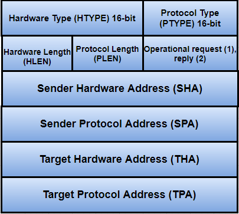

0x003 - ARP

# ARP

- Address Resolution Protocol used only on the same subnet/network. It is dropped by routers.
- It maps IPv4 addresses to Ethernet MAC Addresses
- Sends an ARP frame to the local broadcast address `255.255.255.255` and tells the host that is configured with the target IP Address to reply with its MAC Address.
- ARP maintains a cache which stores the mapping for a temporary time generally about `20 minutes`.

## ARP Frame

First 14 bytes : DST + SRC + Length/Type
Length/Type = **0x0806** for ARP

## Tools to view ARP

### tcpdump

`tcpdump -e -n`  : displays the MAC Address (48 Bit).

### arp

`arp -a` : Display all entries.
`arp -d` : Delete an entry.
`arp -s` : Add an entry (semi-permanent)
`arp -s temp` : Add an entry (temporary, times out with other entries).
`arp -s pub` : Causes the system to act as the responder for that entry.

#### Proxy arp file : `/proc/sys/net/ipv4/conf/*/porxy_arp`
